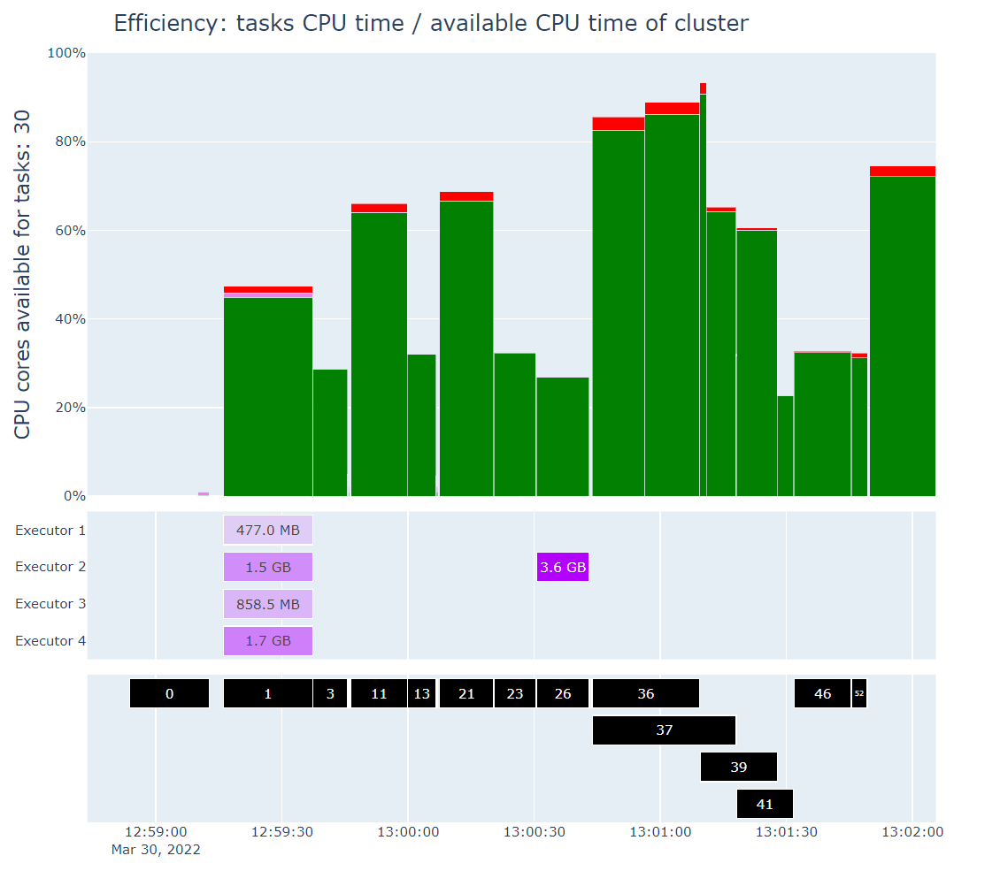
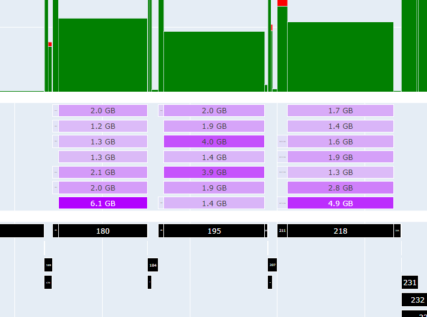

# spark-sight: Spark performance at a glance

[](https://github.com/alfredo-f/spark-sight/blob/master/LICENSE)
[](https://pypi.org/project/dash/)
[](https://pypi.org/project/dash/)
[](https://github.com/alfredo-f/spark-sight/graphs/contributors)

#### *spark-sight is a less detailed, more intuitive representation of what is going on inside your Spark application in terms of performance*.

<br/>

[](https://medium.com/@alfredo.fomitchenko/spark-sight-spark-performance-at-a-glance-c2316d2a251b)

<br/>

[](https://medium.com/@alfredo.fomitchenko/spark-sight-spark-performance-at-a-glance-c2316d2a251b)

Read more on Medium:

1. Part 1: [Meet "spark-sight": Spark Performance at a Glance](https://medium.com/@alfredo.fomitchenko/spark-sight-spark-performance-at-a-glance-c2316d2a251b)
2. Part 2: [“spark-sight” Shows Spill: Skewed Data and Executor Memory](https://medium.com/@alfredo.fomitchenko/spark-sight-shows-spill-skewed-data-and-executor-memory-9169b79ca66e)

[](https://medium.com/@alfredo.fomitchenko/spark-sight-spark-performance-at-a-glance-c2316d2a251b)

## What is it?

**spark-sight** is a less detailed, more intuitive representation 
of what is going on inside your Spark application in terms of performance:

* CPU time spent doing the “actual work”
* CPU time spent doing shuffle reading and writing
* CPU time spent doing serialization and deserialization
* Spill intensity per executor (v0.1.8 or later)
* (coming) Memory usage per executor

**spark-sight** is not meant to replace the Spark UI altogether,
rather it provides a bird’s-eye view of the stages
allowing you to identify at a glance 
which portions of the execution may need improvement.

## Main features
The Plotly figure consists of charts with synced x-axis.

### Top chart: efficiency

The top chart shows **efficiency** in terms of CPU cores available for tasks


### Middle chart: spill

The middle chart shows **spill** information



### Bottom chart: stage timeline

The bottom chart shows stage **timeline**


## Where to get it

```shell
pip install spark-sight
```

## Dependencies

* [**Pandas**: Powerful Python data analysis toolkit](https://github.com/pandas-dev/pandas) 
  for support with Spark event log ingestion and processing 
* [**Plotly**: The interactive graphing library for Python](https://github.com/plotly/plotly.py) 
  for the awesome interactive UI

## Usage

```shell
spark-sight --help
```

```
                      _             _       _     _
 ___ _ __   __ _ _ __| | __     ___(_) __ _| |__ | |_
/ __| '_ \ / _` | '__| |/ /____/ __| |/ _` | '_ \| __|
\__ \ |_) | (_| | |  |   <_____\__ \ | (_| | | | | |_
|___/ .__/ \__,_|_|  |_|\_\    |___/_|\__, |_| |_|\__|
    |_|                               |___/

usage: spark-sight [-h] [--path path] [--cpus cpus] [--deploy_mode [deploy_mode]]

Spark performance at a glance.

optional arguments:
  -h, --help            show this help message and exit
  --path path           Local path to the Spark event log
  --cpus cpus           Total CPU cores of the cluster
  --deploy_mode [deploy_mode]
                        Deploy mode the Spark application was submitted with. Defaults to cluster deploy mode
```

### Unix

```shell
spark-sight \
    --path "/path/to/spark-application-12345" \
    --cpus 32 \
    --deploy_mode "cluster_mode"
```

A new browser tab will be opened.

### Windows PowerShell

```shell
spark-sight `
    --path "C:\path\to\spark-application-12345" `
    --cpus 32 `
    --deploy_mode "cluster_mode"
```

A new browser tab will be opened.

## Read more on Medium

### `spark-sight` Medium series, part 1

[](https://medium.com/@alfredo.fomitchenko/spark-sight-spark-performance-at-a-glance-c2316d2a251b)

[Meet "spark-sight": Spark Performance at a Glance](https://medium.com/@alfredo.fomitchenko/spark-sight-spark-performance-at-a-glance-c2316d2a251b)

### `spark-sight` Medium series, part 2

[](https://medium.com/@alfredo.fomitchenko/spark-sight-shows-spill-skewed-data-and-executor-memory-9169b79ca66e)

[“spark-sight” Shows Spill: Skewed Data and Executor Memory](https://medium.com/@alfredo.fomitchenko/spark-sight-shows-spill-skewed-data-and-executor-memory-9169b79ca66e)
